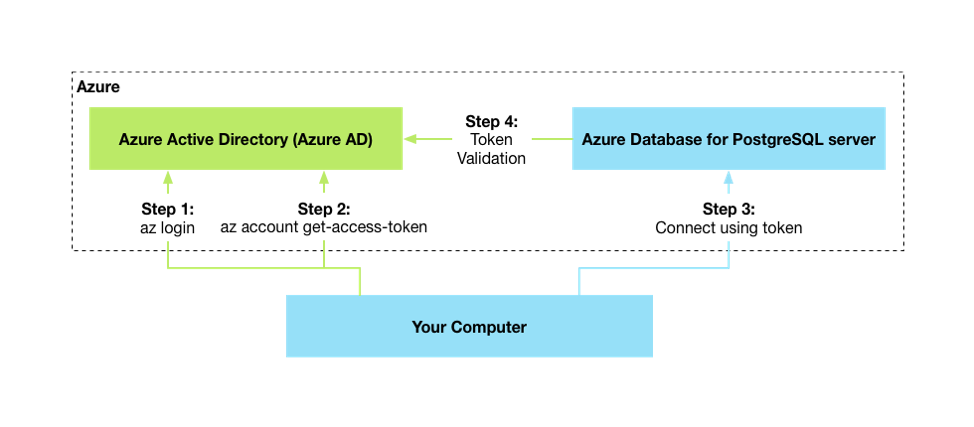
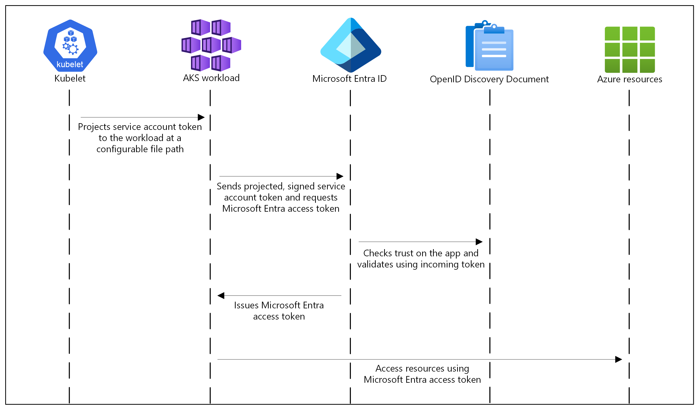

# azure-postgresql-workload-identity

The purpose of this repository is to demonstrate how to access Azure PostgreSQL using Managed Identity through Azure Kubernetes Services (AKS) workload identity.




## Prerequisites
- Azure Subscription
- Azure CLI
- Terraform
- kubectl
- Taskfile

## Overview

Start by creating the test stack:

1. Navigate to the terraform folder.

2. Modify the [locals](./terraform/locals.tf) file by updating the values of `authorized_ip` and `psql_entra_id_admin_email`.

3. Run the following commands:

    ```bash
    terraform init
    terraform plan
    terraform apply
    ```

    This should create 24 resources in total.

Next, follow these steps:

1. Generate an access token to access the Azure PostgreSQL database:

    ```bash
    az account get-access-token --resource https://ossrdbms-aad.database.windows.net
    ```
    This command generates a token to connect to the Azure PostgreSQL database:
    ```json
    {
        "accessToken": "xxx",
        "expiresOn": "0000-00-00 00:00:00.000000",
        "expires_on": 0000000000,
        "subscription": "xxxxxxxx-xxxx-xxxx-xxxx-xxxxxxxxxxxx",
        "tenant": "xxxxxxxx-xxxx-xxxx-xxxx-xxxxxxxxxxxx",
        "tokenType": "Bearer"
    }
    ```

2. Log in to your Azure Virtual Machine Bastion Host using a private key:

    ```bash
    ssh -i <path_to_pem> adminuser@<bastion-ip>
    ```

3. Install the PostgreSQL client on the bastion host:

    ```bash
    sudo apt-get install -y postgresql-client
    ```

4. Connect to the Azure PostgreSQL database using the access token from Step 1:

    ```bash
    export PGPASSWORD=access_token_from_step_1
    psql "host=psql-postgresql-workload-id.postgres.database.azure.com user=entra_id_admin_user_email dbname=postgres sslmode=require"
    ```

5. Create an Entra ID database user with the previously created user-assigned managed identity (identity_principal_id):

    ```sql
    select * from pgaadauth_create_principal_with_oid('id-postgresql-workload-id-app', 'identity_principal_id', 'service', false, false);
    ```

6. Grant your admin user access to the identity, create the app database, and modify default schema permissions:

    ```sql
    GRANT "id-postgresql-workload-id-app" TO "entra_id_admin_user_email";

    CREATE DATABASE app
        WITH
        OWNER = "id-postgresql-workload-id-app"
        ENCODING = 'UTF8'
        LOCALE_PROVIDER = 'libc'
        CONNECTION LIMIT = -1
        IS_TEMPLATE = False;

    GRANT ALL ON DATABASE app TO "id-postgresql-workload-id-app";

    ALTER SCHEMA public
        OWNER TO "id-postgresql-workload-id-app";

7. Modify the [ServiceAccount](./kube_manifests/service_account.yaml) annotation with user managed identity client id:

    ```yaml
    apiVersion: v1
    kind: ServiceAccount
    metadata:
    name: app
    namespace: app
    annotations:
        azure.workload.identity/client-id: "xxxxxxxx-xxxx-xxxx-xxxx-xxxxxxxxxxxx"
    automountServiceAccountToken: false
    ```

8. Build and push the Docker image, then deploy the test CronJob to the AKS cluster:

    ```bash
    task install
    ```

9. Check the CronJob logs: You will see that by providing only the `DBNAME`, `DBUSER`, and `DBHOST` environment variables, the application connects to the Azure PostgreSQL database using the managed identity without a password. It successfully creates a table and inserts three records.


For more information on accessing Azure PostgreSQL with Managed Identity using AKS workload identity, refer to:
- [Azure Kubernetes Service Workload Identity](https://learn.microsoft.com/en-us/azure/aks/workload-identity-overview?tabs=dotnet)
- [Azure PostgreSQL access with Entra ID](https://learn.microsoft.com/en-us/azure/postgresql/single-server/how-to-configure-sign-in-azure-ad-authentication)
